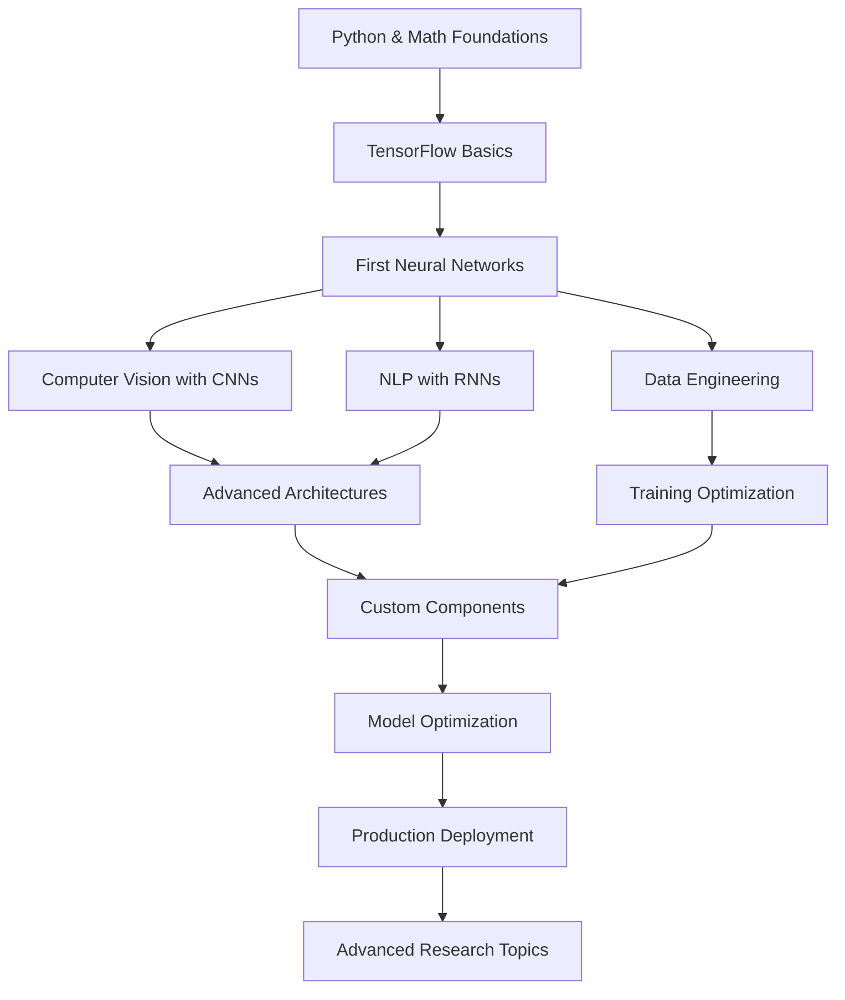

# Location: /docs/CONCEPT_MAP.md

# TensorFlow Learning Concept Map

> **Visual progression and learning path for mastering TensorFlow and deep learning**

## 🎯 Learning Progression Overview

```
Beginner → Intermediate → Advanced → Expert
   |           |            |         |
  3-6         6-12         12-18     18+
 weeks       weeks        weeks     weeks
```

## 🏁 Foundation Level (Weeks 1-6)

### Core Prerequisites

```
Python Fundamentals
├── NumPy Arrays & Operations
├── Matplotlib Visualization
├── Basic Linear Algebra
└── Object-Oriented Programming
```

### TensorFlow Basics

```
TensorFlow 2.x Fundamentals
├── Tensors & Operations
│   ├── Creating Tensors (tf.constant, tf.Variable)
│   ├── Tensor Mathematics (+, -, *, @, tf.matmul)
│   ├── Shape Manipulation (reshape, squeeze, expand_dims)
│   └── Data Types (float32, int32, bool)
│
├── Keras High-Level API
│   ├── Sequential Models
│   ├── Layer Types (Dense, Conv2D, LSTM)
│   ├── Activation Functions (relu, sigmoid, softmax)
│   └── Model Compilation (optimizer, loss, metrics)
│
└── Data Pipeline Basics
    ├── tf.data.Dataset
    ├── Batching & Shuffling
    └── Basic Preprocessing
```

### First Models

```
Hello World Models
├── Linear Regression
│   └── Y = mX + b with tf.keras.Sequential
├── Binary Classification
│   └── Logistic regression with sigmoid
└── Multi-class Classification
    └── Neural network with softmax
```

**Milestone**: Build and train your first neural network

---

## 🚀 Intermediate Level (Weeks 7-18)

### Advanced Model Architectures

```
Deep Learning Architectures
├── Convolutional Neural Networks (CNNs)
│   ├── Conv2D Layers & Feature Maps
│   ├── Pooling Layers (MaxPool, AvgPool)
│   ├── Image Classification Models
│   └── Transfer Learning (ResNet, VGG, EfficientNet)
│
├── Recurrent Neural Networks (RNNs)
│   ├── Vanilla RNN, LSTM, GRU
│   ├── Sequence-to-Sequence Models
│   ├── Text Classification & Generation
│   └── Time Series Prediction
│
└── Advanced Architectures
    ├── Autoencoders (Compression, Denoising)
    ├── Variational Autoencoders (VAEs)
    └── Basic GANs (Generative Models)
```

### Data Engineering & Preprocessing

```
Data Pipeline Mastery
├── tf.data Advanced Features
│   ├── Parallel Processing (map, interleave)
│   ├── Prefetching & Caching
│   ├── TFRecord Format
│   └── Data Augmentation Pipeline
│
├── Preprocessing Layers
│   ├── Normalization & Rescaling
│   ├── Text Processing (TextVectorization)
│   ├── Image Augmentation
│   └── Feature Engineering
│
└── Large Dataset Handling
    ├── Dataset Sharding
    ├── Memory Optimization
    └── Streaming Data Processing
```

### Training Optimization

```
Training Strategies
├── Regularization Techniques
│   ├── Dropout & Batch Normalization
│   ├── L1/L2 Regularization
│   ├── Early Stopping
│   └── Data Augmentation
│
├── Advanced Optimizers
│   ├── Adam, RMSprop, AdaGrad
│   ├── Learning Rate Scheduling
│   ├── Gradient Clipping
│   └── Custom Optimizers
│
└── Training Monitoring
    ├── TensorBoard Integration
    ├── Custom Metrics & Callbacks
    ├── Model Checkpointing
    └── Hyperparameter Tuning
```

**Milestone**: Build production-ready models with proper validation

---

## 🎓 Advanced Level (Weeks 19-30)

### Custom Components

```
TensorFlow Internals
├── Custom Layers & Models
│   ├── Subclassing tf.keras.layers.Layer
│   ├── Custom Training Loops
│   ├── GradientTape Operations
│   └── Advanced Model Architectures
│
├── Custom Loss Functions & Metrics
│   ├── Complex Loss Formulations
│   ├── Multi-task Learning Losses
│   ├── Custom Metric Classes
│   └── Weighted & Focal Losses
│
└── Advanced Data Processing
    ├── Custom tf.data Transformations
    ├── TensorFlow Transform (TFX)
    ├── Feature Stores Integration
    └── Real-time Data Streaming
```

### Model Optimization & Deployment

```
Production Deployment
├── Model Optimization
│   ├── Quantization (INT8, FP16)
│   ├── Pruning & Sparsity
│   ├── Knowledge Distillation
│   └── TensorFlow Lite Conversion
│
├── Serving & Inference
│   ├── TensorFlow Serving
│   ├── TensorFlow.js (Browser)
│   ├── TensorFlow Lite (Mobile)
│   └── Edge Device Deployment
│
└── Monitoring & MLOps
    ├── Model Performance Monitoring
    ├── A/B Testing for Models
    ├── Continuous Training Pipelines
    └── Version Control for Models
```

### Advanced Topics

```
Cutting-Edge Techniques
├── Transformer Architectures
│   ├── Attention Mechanisms
│   ├── BERT & GPT Implementation
│   ├── Vision Transformers (ViT)
│   └── Multi-modal Transformers
│
├── Generative Models
│   ├── Advanced GANs (StyleGAN, CycleGAN)
│   ├── Diffusion Models
│   ├── Neural Style Transfer
│   └── Text-to-Image Generation
│
└── Reinforcement Learning
    ├── Q-Learning with Neural Networks
    ├── Policy Gradient Methods
    ├── Actor-Critic Algorithms
    └── TF-Agents Framework
```

**Milestone**: Implement state-of-the-art architectures from research papers

---

## 🏆 Expert Level (Weeks 31+)

### Research & Innovation

```
Advanced Research Topics
├── Meta-Learning & Few-Shot Learning
├── Neural Architecture Search (NAS)
├── Federated Learning
├── Quantum Machine Learning (TFQ)
└── Neuromorphic Computing
```

### System Design & Scale

```
Enterprise ML Systems
├── Distributed Training Strategies
├── Multi-GPU & TPU Training
├── Large-Scale Data Processing
├── Model Parallelism & Sharding
└── Cost Optimization for Training
```

## 📊 Learning Path Flowchart



## 🛤️ Recommended Learning Tracks

### Track 1: Computer Vision Specialist

```
Foundation → CNNs → Transfer Learning → Advanced CV
    ↓
Object Detection → Image Segmentation → GANs → Vision Transformers
```

### Track 2: NLP Specialist

```
Foundation → RNNs → Text Processing → Transformers
    ↓
BERT/GPT → Language Models → Text Generation → Conversational AI
```

### Track 3: MLOps Engineer

```
Foundation → Model Training → Optimization → Deployment
    ↓
TF Serving → Monitoring → CI/CD → Distributed Systems
```

### Track 4: Research Scientist

```
Foundation → Advanced Architectures → Custom Components → Research
    ↓
Paper Implementation → Novel Architectures → Open Source → Publications
```

## 📚 Learning Resources by Level

### Foundation Resources

- **Books**: "Hands-On Machine Learning" by Aurélien Géron
- **Courses**: TensorFlow Developer Certificate Program
- **Practice**: Kaggle Learn TensorFlow course
- **Projects**: MNIST, CIFAR-10, Basic text classification

### Intermediate Resources

- **Books**: "Deep Learning" by Ian Goodfellow
- **Courses**: CS231n (Computer Vision), CS224n (NLP)
- **Practice**: Kaggle competitions, Google Colab tutorials
- **Projects**: Image classification, sentiment analysis, time series

### Advanced Resources

- **Papers**: ArXiv papers, Google AI blog
- **Courses**: Advanced TensorFlow specialization
- **Practice**: Research paper implementations
- **Projects**: Custom architectures, production deployments

### Expert Resources

- **Research**: Cutting-edge papers, conferences (NeurIPS, ICML)
- **Community**: TensorFlow SIG groups, research collaborations
- **Projects**: Novel research, open-source contributions

## 🎯 Skill Assessment Checkpoints

### Foundation Checkpoint

- [ ] Create and manipulate tensors fluently
- [ ] Build simple neural networks with tf.keras
- [ ] Train models with proper validation
- [ ] Visualize results and understand metrics
- [ ] Debug common training issues

### Intermediate Checkpoint

- [ ] Implement CNN and RNN architectures
- [ ] Use transfer learning effectively
- [ ] Build efficient data pipelines
- [ ] Apply regularization techniques
- [ ] Use TensorBoard for monitoring

### Advanced Checkpoint

- [ ] Create custom layers and training loops
- [ ] Optimize models for production
- [ ] Deploy models to various platforms
- [ ] Implement research paper architectures
- [ ] Handle distributed training

### Expert Checkpoint

- [ ] Contribute to TensorFlow ecosystem
- [ ] Design novel architectures
- [ ] Lead ML system architecture
- [ ] Mentor other developers
- [ ] Publish research or technical content

## 🔄 Continuous Learning Loop

```
Practice → Build → Deploy → Monitor → Learn → Repeat
    ↑                                           ↓
    └── Stay Updated with Research & Community ←┘
```

### Stay Current

- **Follow**: TensorFlow blog, research papers
- **Engage**: Stack Overflow, GitHub discussions
- **Practice**: Kaggle, personal projects
- **Network**: ML conferences, local meetups
- **Teach**: Blog posts, tutorials, mentoring

## 🎨 Project-Based Learning Path

### Month 1-2: Foundation Projects

1. **Linear Regression**: House price prediction
2. **Classification**: Iris flower classification
3. **Image Classification**: MNIST digits
4. **Text Classification**: Movie sentiment analysis

### Month 3-4: Intermediate Projects

1. **CNN Project**: CIFAR-10 image classification
2. **RNN Project**: Stock price prediction
3. **Transfer Learning**: Custom image classifier
4. **NLP Pipeline**: Text preprocessing to classification

### Month 5-6: Advanced Projects

1. **Custom Architecture**: Novel CNN design
2. **GANs**: Generate synthetic images
3. **Deployment**: Model serving with TensorFlow Serving
4. **Optimization**: Model quantization and pruning

### Month 7+: Expert Projects

1. **Research Implementation**: Latest paper recreation
2. **Production System**: End-to-end ML pipeline
3. **Open Source**: Contribute to TensorFlow ecosystem
4. **Innovation**: Novel research or applications

---

**🎯 Remember**: This is a marathon, not a sprint. Focus on understanding concepts deeply rather than rushing through topics. Build projects at each level to solidify your understanding!
